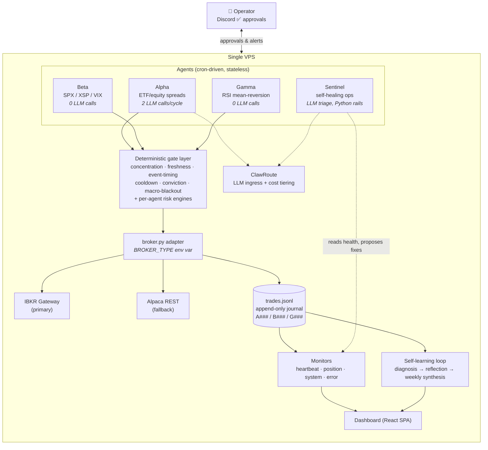
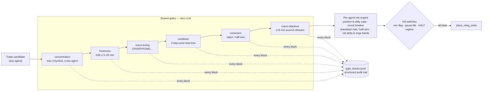
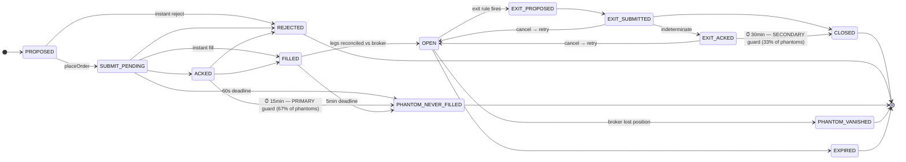

# QuantAI

**An autonomous multi-agent trading system where every safety guarantee is deterministic Python — and LLMs are used only where judgment is needed.**

[](https://github.com/amitc3353/QuantAI/actions/workflows/ci.yml)


Four narrow Python agents operate a $1M IBKR paper account during US market hours. Three of them trade; one heals the infrastructure. Two of the three trading agents make **zero LLM calls** — and where an LLM does make a judgment call, a deterministic risk layer can override it. Total LLM spend: **~$4–5/month**. Everything runs on a single VPS, operated from a phone over Discord.

> **Use LLMs only where judgment is needed. Enforce safety rules in code, not in prompts.**
>
> Most of what makes this project interesting follows from taking that sentence seriously.

---

## ⚠️ Status: work in progress — deliberately

This is a live engineering project, not a finished product. The honest timeline:

- **Mar–Jun 2026** — built and operated: broker migration (Alpaca → IBKR native index options), three trading agents, a self-healing ops agent, monitoring, and a self-learning loop.
- **May 2026** — a real production incident: a journal reset produced duplicate trade IDs, the position monitor fired duplicate closes, and broker positions inverted. [Full postmortem →](docs/2026-06-02-gamma-incident-recovery.md) · [Recovery, with broker-authoritative P&L →](docs/2026-06-03-recovery-complete.md)
- **Jun 2026** — response: a 13-state order-lifecycle FSM designed from forensic data on where orders actually die, shipped through a shadow-mode rollout while entries stayed paused.
- **Now** — a severity-rated **production-hardening phase** ([`docs/HARDENING.md`](docs/HARDENING.md)): every remaining safety gap gets a red→green proof-test before trading resumes.

Pausing a trading system to harden it *is* the discipline this system is about. The exit path, monitors, and learning loop stay live throughout.

---

## System topology



No message bus, no orchestrator daemon, no long-lived process. **Cron is the metronome** — every script runs to completion and exits; state lives on disk; the append-only journal is the single source of truth.

## The four agents

| Agent | Trades | Decision method | LLM calls/cycle | Trade IDs |
|-------|--------|-----------------|:---:|:---:|
| **Alpha** | Defined-risk spreads, 88-ticker ETF/equity universe | LLM proposal → Python Bull/Bear templates → LLM judge | **2** | `A###` |
| **Beta** | SPX / XSP / VIX native index options | 12-regime deterministic classifier → 8 strategy modules | **0** | `B###` |
| **Gamma** | Bull-call debit spreads (Connors RSI mean-reversion, 155 instruments) | Deterministic scan-after-close → re-validate-at-open | **0** | `G###` |
| **Sentinel** | Nothing — heals infrastructure | LLM classifies fixes; hard-coded Python rails decide | 1–2 | — |

All four write to one append-only JSONL journal. One broker adapter (`broker.py`) swaps IBKR ↔ Alpaca with an env var. A position monitor owns the exit path and reconciles journal vs. broker truth every 2 minutes.

---

## Where the LLM is — and isn't

This is the core design argument, made measurable:

- **2 of 3 trading agents are fully deterministic.** Beta's 12-regime classifier and Gamma's scanner are pure Python — same inputs, same trade, replayable forever.
- **The "debate" is cheaper than it looks.** Alpha's Bull/Bear advocacy started as LLM calls. Measurement showed the output was *mechanical* — so it became Python lookup templates, eliminating **~80 LLM calls/day** and leaving exactly 2 Sonnet calls per cycle: one proposal, one judge. Judgment stays with the model; mechanics moved to code.
- **Every LLM call is metered.** `_llm_call.py` logs one JSONL record per call — tokens, USD cost, latency, requested vs. actual model, routing tier. All traffic flows through a single cost-tiering ingress (ClawRoute) that routes cheap tasks to cheap models. Total: ~$4–5/month.
- **The reliability envelope is code.** 3 attempts with error-class-aware backoff; 429s honor `Retry-After` with a *cross-process* state file so a restarted cron job doesn't re-hammer a rate-limited provider; 4-stage JSON extraction with a corrective-hint retry; on exhaustion, the raw payload is logged and the caller receives `None` — never an exception.
- **Memory closes a loop.** Post-trade reflections are retrieved per candidate symbol and injected into both the proposal and judge prompts, so past mistakes inform the next decision (currently Alpha-only, recency-ranked — semantic retrieval is on the roadmap).

## The deterministic gate layer

Every trade proposal — LLM-originated or not — passes through pure-Python gates before the broker sees it:



Details that matter:

- **Fail-open vs. fail-closed is argued per gate, in the gate's docstring.** Concentration, freshness, and cooldown fail closed (no data → no trade). Event-calendar and macro-blackout fail open, with the reasoning documented — a data-vendor outage shouldn't silently halt all trading, but a stale intelligence file must.
- **Every block is a structured audit record** (`gate`, `symbol`, `agent`, `reason`, `would_have_been_strategy`) — the substrate for false-positive auditing and, next, a regression eval harness.
- **Risk limits are scoped per agent** — Beta's circuit breaker (5 consecutive losses), daily drawdown halt (2%), and greek bands (net delta ±0.5, net vega ±1.0) count only Beta's trades, so one agent's losing streak can't freeze another.
- **Three independent kill switches**: a per-agent env flag, an `entry_pause.flag` file any operator can drop, and the market-regime `HALT` state.
- Sizing has a deliberate asymmetry: position sizing uses `min(real equity, $50k)` so a $1M paper balance doesn't oversize every trade, while drawdown gates read *real* equity.

## The order lifecycle FSM — built from forensic data

The single most instructive artifact in this repo. After phantom positions kept appearing (journal says OPEN, broker says nothing — or the reverse), a forensic script binned **every historical phantom by where the order actually died**:

> **67%** died on the ACKED → FILLED path (broker acknowledged, never filled).
> **33%** died on the exit path (close submitted, never confirmed).

So the FSM's two tightest deadlines and heaviest test coverage sit on exactly those two transitions — the numbers are cited in the source (`lifecycle/states.py`):



- **13 states, 20 legal transitions** — anything else raises `IllegalTransition`.
- **The FSM never writes to the journal.** `advance()` returns `(new_state, updates)`; the caller persists. That makes it filesystem-free to test — including **property-based tests** (Hypothesis: from any non-terminal state, any event sequence reaches a terminal state and never leaves it) and a **replay test** that runs the entire historical journal through the FSM, including 21 known-bad legacy records.
- **Rollout was gated, not flag-day**: `off → shadow` (FSM runs in parallel, divergences logged, legacy path governs) `→ enforce_exit_only → enforce`, with entry crons paused for the riskiest phases.

## When it broke — and what that bought

The system has real scar tissue, and the repo documents it instead of hiding it:

- **The duplicate-ID cascade** ([postmortem](docs/2026-06-02-gamma-incident-recovery.md)): an experiment reset truncated per-arm journals but not the union journal → duplicate trade IDs → duplicate close orders → **inverted broker positions**, compounded by a test-suite fork-bomb that OOM-killed the broker gateway. [Recovery](docs/2026-06-03-recovery-complete.md) has the UTC timeline, the broker-authoritative realized P&L for flattening, and the three shipped fixes with commit SHAs.
- **Ghost reconciliation names three distinct failure modes** and checks for each every 2 minutes: the *true ghost* (broker position no journal entry references), the *journal lie* (entry says CLOSED, broker still holds legs), and the *entry phantom* (entry says OPEN, broker holds nothing).
- **`verify_legs_flat()` fails closed**: after a close order reports success, the broker is queried again — the journal accepts CLOSED only when every leg is confirmed at zero quantity. On any error it returns a sentinel that blocks the CLOSED write. Built after a `Cancelled` close was recorded as a success.
- **Partial-fill recovery**: if an exception fires *after* an order was already submitted, the adapter flushes async callbacks and recovers the working order by its idempotency key (`orderRef`) instead of blindly resubmitting. `place_mleg_order` returns `None` on terminal failure — never raises into a caller, and is never auto-retried.

## Sentinel — self-healing with hard rails

An LLM-driven ops agent that reads health reports, error logs, and the journal, then proposes fixes. The interesting part is what it's *not allowed to do*, and how that's enforced:

- **Dual gating.** The LLM classifies each fix `safe_auto` / `propose_wait` / `never_touch` — and then a pure-Python `validate_proposal()` re-validates every proposal **twice**: at queue time and again at consume time, after re-reading market state and open positions. The LLM's opinion is never sufficient.
- **Hard-coded rails, none LLM-overrideable**: a NEVER-modify list covering every trading-path file and the frozen experiment internals; a write allowlist; a credential-pattern path rejector; **80-line diff cap**; 3 file mutations + 2 service restarts max per run; 3-attempt budget then quarantine + escalation; 48h approval expiry with a 72h re-propose suppression window (deliberately longer, so an expired card can't instantly reappear).
- **Human in the loop where it counts**: `propose_wait` fixes post a Discord card and require a ✅ **from a non-bot user**. `.bak` before every patched file; one-command `--rollback`.
- **It downgrades itself**: if an apply-mode run ever fires inside the trading window, it converts to read-only observe mode.
- **Two guards born from real incidents**: a *hallucination pre-flight* that rejects `cd` targets that don't exist and `systemctl` verbs against unregistered units (added after the agent proposed both), and a *fork-bomb guard* after a self-test recursion — Sentinel auto-running pytest, which contained a test that ran Sentinel — exhausted RAM and OOM-killed the broker gateway twice.

## Experimentation with pre-registered rules

Gamma's ranking logic runs as a **4-arm experiment**: four ranking philosophies over identical signals, each with its own isolated $10K virtual portfolio, own circuit breakers, own trade-ID prefix. Signal logic, caps, and universe are frozen across arms — it's a ranking test, not a signal test.

The promotion decision is a **pure deterministic function committed before the experiment started** (`gamma/promotion_evaluator.py`): an 80-closed-trade floor per arm, a 15% P&L win margin that must *also* hold on Sharpe, an Ockham tie-break preferring the simpler arm, and a 180-day hard cap that defaults to the control. The docstring states the point: the rule book is locked so nobody can move the goalposts — and Sentinel is code-forbidden from touching the evaluator files. [Full design doc, 9 locked decisions each with a defense →](docs/gamma-four-arm-ab-test-plan.md)

## Testing

**1,315 tests across 79 files**, runnable with zero live services (the conftest fakes the broker with an FSM-aware stub, blocks real Discord posts, and sandboxes all runtime paths):

- **Property-based** (Hypothesis): the lifecycle FSM reaches a terminal state from any starting point under any event sequence, and terminals are absorbing.
- **Replay**: the full historical trade journal — including 21 known-bad legacy records — must map to legal terminal states.
- **Adversarial safety fixtures**: explicit `_REJECTED` tests prove Sentinel refuses trading-path targets, over-cap diffs, and hallucinated systemd units.
- Focused suites on the highest-risk seams: partial-fill recovery (36 tests), the beta risk engine (51), promotion logic (25), circuit-breaker reset boundaries.

```bash
git clone https://github.com/amitc3353/QuantAI.git && cd QuantAI
cd v2/shared-data/tests && python3 -m pytest unit/ integration/ -q
```

(The full trading system needs a VPS with IB Gateway and environment configuration — this repo is offered as a **read-only architecture tour**, not a deploy-me product.)

## Honest gaps

Documented in [`docs/HARDENING.md`](docs/HARDENING.md) with severity ratings and required proof-tests — the highlights:

- **No eval harness yet.** The decision-trace substrate exists (every gate block and every ranking decision is a structured JSONL record); scoring agent behavior against golden traces is the next major build.
- **One safety rule still lives in a prompt**: Alpha's judge-score threshold is instructed, not enforced — moving it to a code gate is a top hardening item.
- **The pre-push test gate isn't committed yet**, and the journal lacks file locking under concurrent writers. Both tracked, both scoped.

A system that publishes its own gap list is making a claim about how it treats the rest of its claims.

## What's next

**Horizon 1 — hardening spine** (active, in order, from [`HARDENING.md`](docs/HARDENING.md)): commit the pre-push test gate and make the 9:30 ET pre-trade check hard-block; move the judge threshold into code; make Sentinel validate diff-body paths, not just declared targets; fail-closed parsing on risk fields; journal `flock` + close idempotency; pre-submission price re-validation for Alpha/Beta (Gamma already re-validates); deterministic paging for the LLM-gateway and Discord single points of failure.

**Horizon 2 — the self-learning architecture** (designed): one substrate serving both an error-autofix loop and trade learning — *capture → retrieve priors → act with graded confidence → verify → record → recalibrate*:

| Capability | Design |
|---|---|
| Decision spine | In-process event emitter + append-only decision journal |
| Experience memory | Embedding retrieval (sqlite-vec) with Beta-Bernoulli confidence, split from a durable knowledge base |
| Trade learning | Stats-first: Wilson-bounded edge buckets; reflection explains, statistics decide |
| Change gating | Decision-replay backtests — no strategy change ships without passing replay |
| Error self-healing | Fix loop verified by reproduction tests (a fix counts only if the repro test flips red→green) |
| Autonomy graduation | Per-fix-class Thompson sampling: human-approved → autonomous, earned per class |
| Agent evals | Golden decision-trace regression scoring built on `gate_blocks.jsonl` |

Status tags are honest: *active* means commits are landing; *designed* means the plan exists and the build hasn't started. No dates promised.

## Documentation map

| Doc | What it covers |
|---|---|
| [`docs/ARCHITECTURE_SUMMARY.md`](docs/ARCHITECTURE_SUMMARY.md) | 10-minute prose tour — **start here** |
| [`docs/architecture.md`](docs/architecture.md) | 2,500-line deep reference; every section has an ELI10 *and* a good/bad/could-be-better verdict |
| [`docs/00-ARCHITECTURE-DECISIONS.md`](docs/00-ARCHITECTURE-DECISIONS.md) | ADRs — incl. ADR-002, cost discipline via a single LLM ingress |
| [`docs/2026-06-02-gamma-incident-recovery.md`](docs/2026-06-02-gamma-incident-recovery.md) | The production incident, unvarnished |
| [`docs/runbooks/`](docs/runbooks/) | 12 runbooks wired to a 308-entry error catalog that a zero-LLM learner grows automatically |
| [`docs/HARDENING.md`](docs/HARDENING.md) | The severity-rated hardening tracker gating the return to trading |
| [`docs/gamma-four-arm-ab-test-plan.md`](docs/gamma-four-arm-ab-test-plan.md) | Pre-registered experiment design |
| [`CLAUDE.md`](CLAUDE.md) | How AI coding agents are directed inside a production system — guardrails for the *builders*, not just the traders |
| [`legacy/`](legacy/) | The retired v1 Docker stack, kept for the v1→v2 story |

## Design principles

- **LLMs only where judgment is needed.** Beta and Gamma are zero-LLM. The safety layer is zero-LLM. Alpha uses exactly two calls where judgment genuinely helps.
- **Safety in code.** A model can propose; only Python disposes. Where a rule still lives in a prompt, the gap is tracked publicly.
- **Cron is the metronome.** No daemons, no bus. Every script runs to completion and exits.
- **The journal is the truth.** One append-only file feeds every monitor, dashboard tile, and learning pass.
- **Failures are data.** Postmortems with real P&L, an error taxonomy that grows itself, and an FSM designed from measured failure distributions — not imagined ones.

---

*Built and operated by Amit Chandel. Engineering-metric claims in this README are verifiable from the repo; trading is paper-only while the hardening phase completes.*

<details>
<summary>Sample: the daily Discord summary the operator wakes up to</summary>

```
📊 QuantAI Daily Summary — May 3, 2026

🤖 Agent Alpha (Bull put spreads & directional strategies)
  Traded today: 1
  A001 MSTR BULL PUT SPREAD | Credit: $0.78 | OPEN
  All-time: 3 closed | Win rate: 67% | P&L: +$145

🤖 Agent Beta (Iron condors & range-bound strategies)
  No trades today — VIX 23.9 not range-bound enough
  All-time: 1 closed | Win rate: 100% | P&L: +$62

🤖 Agent Gamma (RSI(10) mean-reversion on equity options)
  No trades today — RSI watchlist empty after overnight scan
  All-time: 0 closed | Win rate: N/A

Total open: 1 | Combined P&L: +$207
```

Some days the right trade count is zero — and the agents saying so, with reasons, is the feature.

</details>
